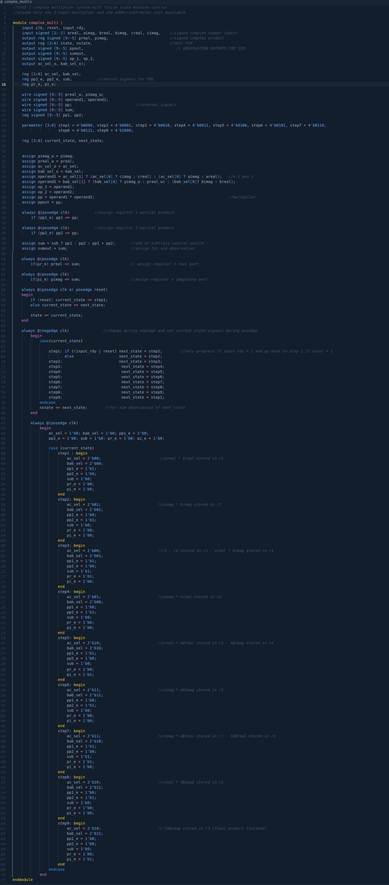

🔢 FPGA Complex Multiplier with Serial Two's Complement

A complex multiplier implemented in Verilog HDL for FPGAs, supporting 2-decimal-point fixed-point arithmetic. Includes a serial two's complement converter using a finite state machine (FSM) for efficient signed-number processing.
*actual verilog code file was lost, but the picture of the code used for the report is included. 

🐈‍⬛ Key Features

    Complex Number Multiplication:

        Computes (a + bi) * (c + di) = (ac - bd) + (ad + bc)i

        2-decimal fixed-point precision (e.g., 1.23 + 4.56i).

    Serial Two’s Complement:

        FSM-based conversion for signed numbers.

        Processes data bit-by-bit (resource-efficient).

    FPGA-Optimized:

        Pipelined for low latency.

        Verified on Altera FPGA board

✅ Design snapshots

💻 RTL of final design

